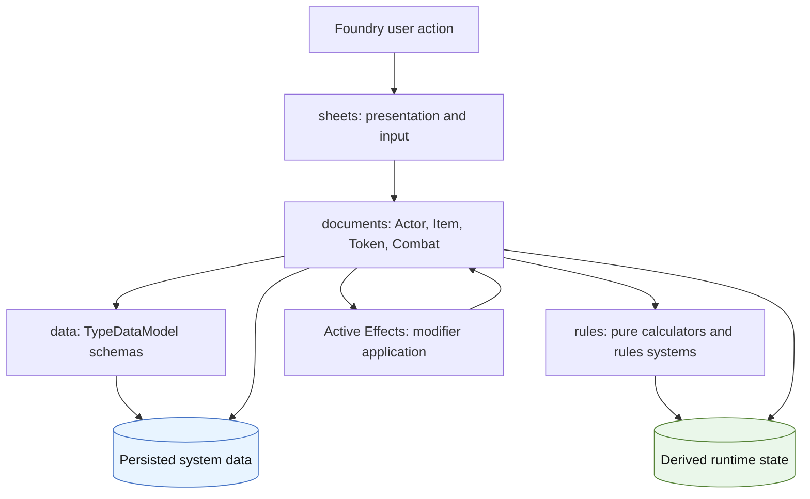
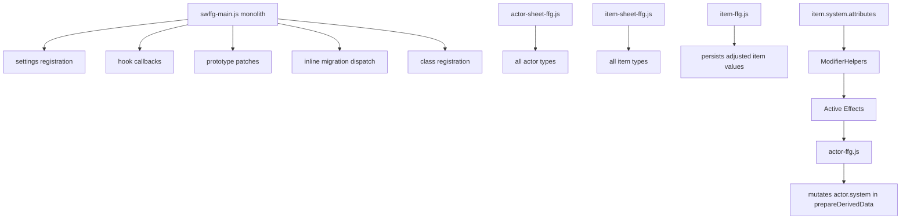
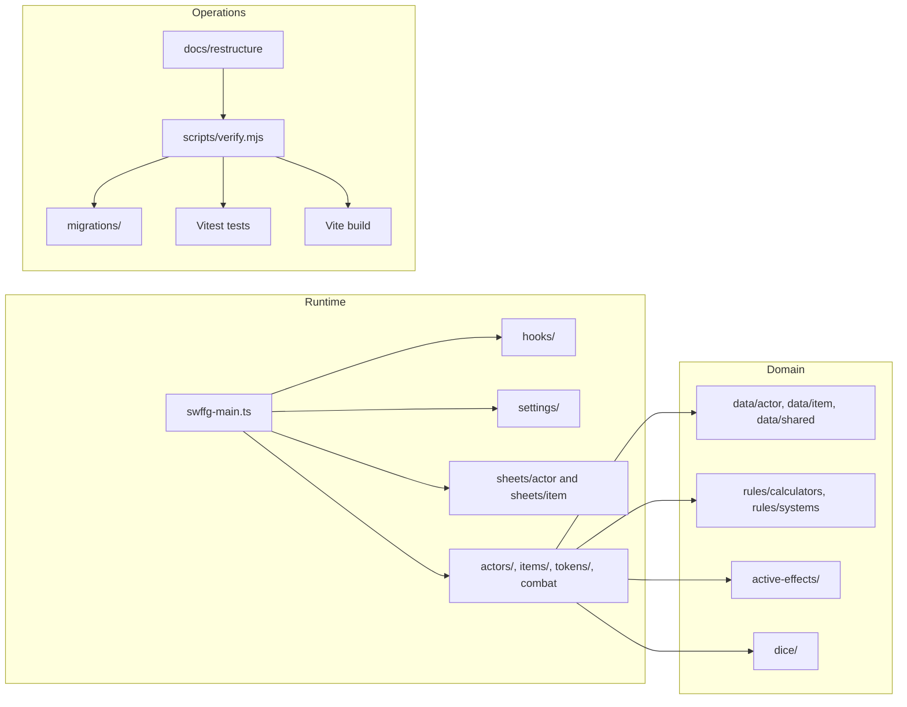
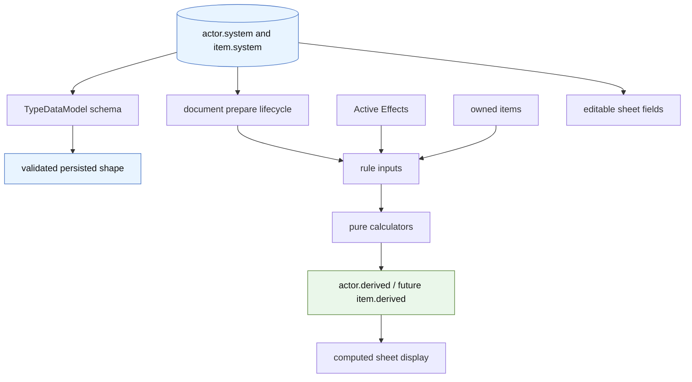
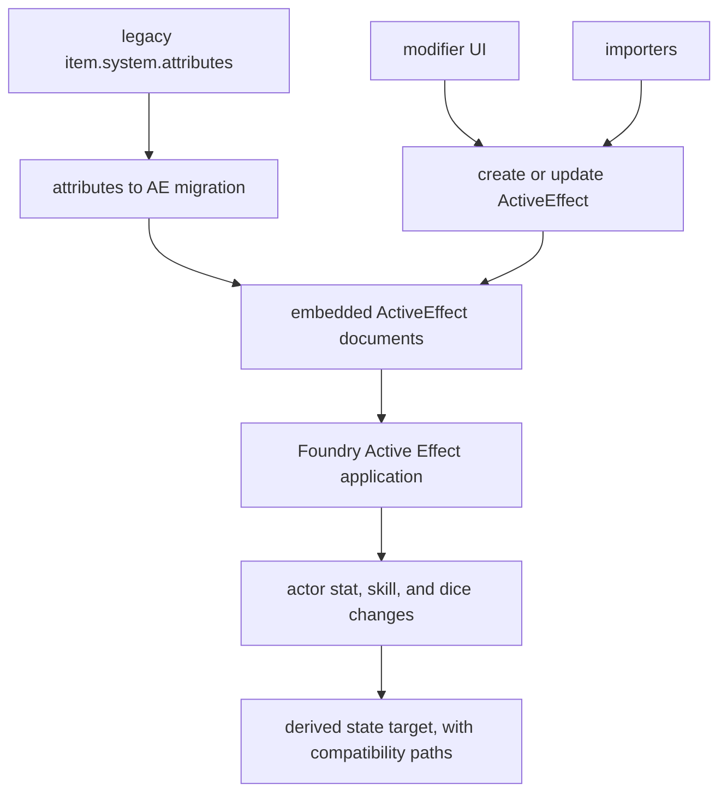
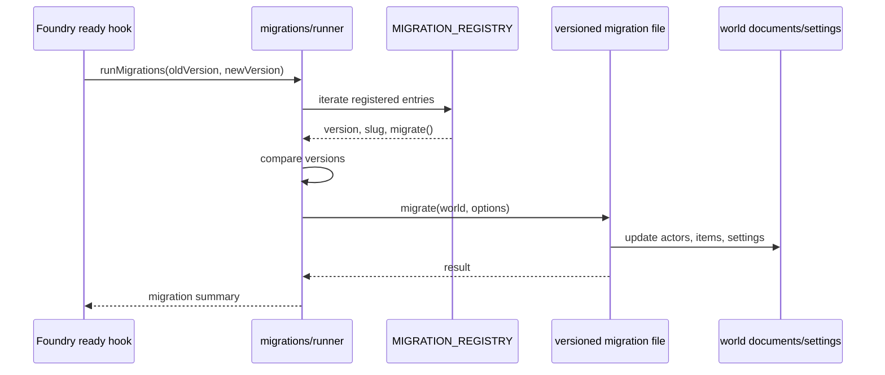
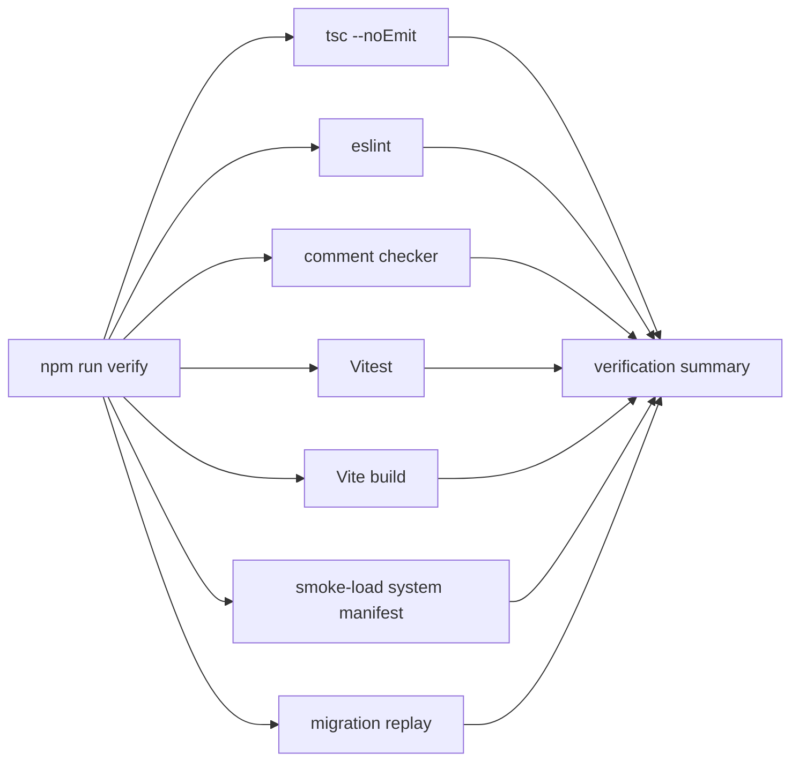
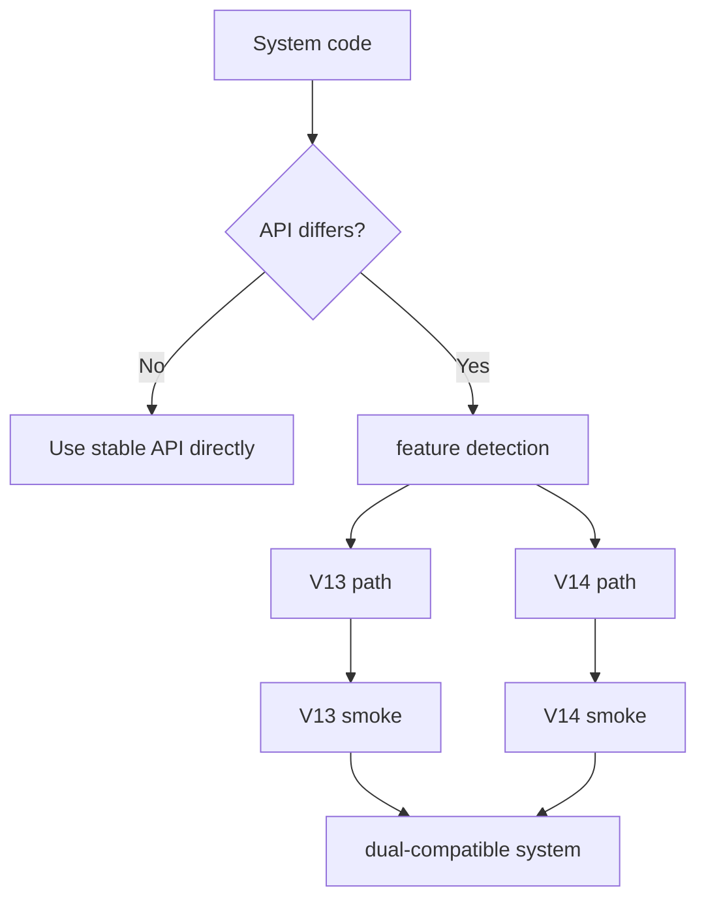
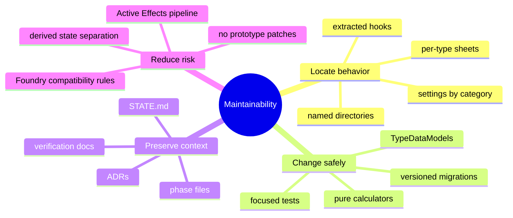

What # Restructure Architecture Changes and Benefits

This document summarizes the architectural changes made during the restructure,
why they matter, and how the system is intended to be maintained going forward.
It complements:

- `current-state.md` - the frozen upstream-start baseline
- `target-state.md` - the desired end state
- `decision-log.md` - ADRs explaining non-obvious decisions
- `../STATE.md` - current phase and known issues

Status as of 2026-05-31: phases 0-12 are complete and Phase 13 V14
compatibility certification is open. The codebase is now TypeScript-based with
strict typechecking enabled, but several large legacy modules still use
`@ts-nocheck` and remain cleanup targets.

## Architectural Direction

The restructure moves the system away from large, mutation-heavy legacy modules
toward explicit boundaries:

- `data/` defines document schemas.
- `rules/` contains pure game-rule calculation.
- document classes own lifecycle and persistence.
- sheets own presentation and user interaction.
- migrations are versioned and replayable.
- setup, hooks, settings, and registration are split into named modules.

## Legacy Shape

Before the restructure, too many responsibilities flowed through a few large
files. `swffg-main.js` registered classes, settings, hooks, prototype patches,
and migrations. Actor and item sheets handled every type in large base classes.
Modifiers existed in both custom `system.attributes` data and Active Effects.

The main problems with that shape were:

- behavior was hard to locate by file name;
- derived values and persisted values were mixed together;
- old migrations used fragile version checks;
- tests could not isolate rule logic from Foundry runtime globals;
- prototype patching made Foundry upgrades risky;
- AI and human sessions had no durable operating protocol.

## Current Restructured Shape

The codebase is now organized around named subsystems. Some legacy base classes
remain, but much of the surrounding infrastructure is explicit and testable.

## Major Changes and Benefits

| Area | Architectural change | Benefit |
|---|---|---|
| Runbook | Added permanent restructure protocol, state tracking, verification rules, and ADRs. | Cold sessions can resume safely; decisions are preserved; architectural drift is easier to detect. |
| Build | Added Vite and a Foundry-loadable build output. | TypeScript can compile to deployable ES modules; build and smoke-load become automated gates. |
| TypeScript | Converted modules to `.ts`, enabled `strict` and `noImplicitAny`. | Typecheck catches undefined access and signature drift; future cleanup can remove `@ts-nocheck` incrementally. |
| Rules | Extracted pure calculators under `rules/calculators`. | Core math can be tested without Foundry documents or UI. |
| Settings | Split many settings registrations into `settings/` modules. | Settings are discoverable by category instead of buried in startup code. |
| Hooks | Extracted hook registration into named hook modules. | Hook behavior is easier to locate, test, and audit for Foundry API changes. |
| Prototype cleanup | Replaced prototype patching with subclass/registration patterns for token bars and dice registration. | Safer Foundry upgrades and clearer ownership of overrides. |
| DataModels | Added actor and item `TypeDataModel` classes for all 6 actor types and 20 item types. | Schemas are explicit, type-friendly, and local to the data they describe. |
| Derived state | Added `actor.derived` as the destination for recomputed values. | Starts separating stored data from runtime calculation, reducing stale-value bugs. |
| Modifiers | Moved toward Active Effects as the canonical modifier pipeline. | Reduces duplicated modifier logic and aligns with Foundry-native behavior. |
| Sheets | Added per-type sheet classes and removed thin V2 reskin classes. | Each actor/item type has a named entry point even while base sheet code remains shared. |
| Importer | Reduced importer monolith and extracted focused OggDude/template/AE utilities. | Import behavior is easier to isolate by responsibility. |
| Rules systems | Added a `RulesSystem` abstraction for Star Wars vs Genesys behavior. | Theme-specific behavior can move out of scattered string checks. |
| Migrations | Replaced monolithic parseFloat dispatcher with versioned migration registry and runner. | Migration ordering is explicit and testable. |
| Verification | Added typecheck, lint, comments, tests, build, smoke-load, and migration replay gates. | Quality checks are visible and repeatable. |

## Data and Derived State

The long-term contract is: `system.*` stores user/source data, while
`derived.*` stores recomputed runtime values. The current implementation has the
derived namespace in place and some AE-independent derived calculations moved;
AE-dependent derived state and remaining adjusted item values still need
cleanup.

Benefits:

- Prevents computed values from being saved back into the world by accident.
- Makes recalculation repeatable after item, effect, or setting changes.
- Gives tests pure inputs and outputs instead of requiring full Foundry actors.
- Makes sheet templates clearer: editable fields come from `system`; computed
  display values come from `derived`.

## Modifier Pipeline

The target modifier architecture is Active Effects only. The legacy
`system.attributes` map is still present in compatibility paths, but the
direction is to migrate user-authored modifiers into embedded Active Effects and
delete the custom calculation pipeline once safe.

Benefits:

- One modifier representation instead of two.
- Modifier behavior follows Foundry conventions and future Foundry improvements.
- Item, actor, migration, and UI code can share one tested modifier taxonomy.
- Custom FFG behavior can be expressed as AE change modes rather than scattered
  item-type branches.

Current caution:

- Migration fixture coverage is still a major gap.
- Some legacy adjusted item fields and attribute compatibility paths remain.
- The 1.907 migration compatibility shim still constrains full deletion of the
  old modifier helper.

## Migration Architecture

Migrations are now registered as versioned modules and run through a shared
runner. This replaces the old inline migration dispatcher and version
comparison logic.

Benefits:

- Each migration has a stable file and description.
- Version ordering is centralized.
- Unit tests can exercise the runner without importing every Foundry-dependent
  migration.
- Future migrations can be added without editing a large dispatcher.

Current caution:

- The replay gate currently has limited fixture coverage.
- Some older migrations still require real Foundry document instances.
- Forward-only migration behavior must be protected before removing legacy
  schema fields.

## Verification Architecture

Verification is meant to prove every layer remains loadable and internally
consistent.

Benefits:

- Type-level regressions are caught before runtime.
- Pure rules, DataModel schema declarations, migrations, and dice behavior can
  be tested automatically.
- Build output is checked before Foundry smoke testing.
- Future CI can run the same gate locally and remotely.

Current caution:

- Lint remains known-red.
- The run-all verification behavior should remain visible while lint is known-red
  so later gates are not hidden.
- Phase 13 should extend smoke coverage for V13 and V14.

## Foundry Compatibility

The restructure targets Foundry V13 today and keeps the architecture ready for
V14 certification.

Benefits:

- Avoids version-string branches where capability checks are enough.
- Keeps user worlds on V13 usable while V14 support is certified.
- Makes future Foundry upgrades an explicit architecture phase rather than an
  emergency patch.

## Human Maintainability Benefits

The restructure is not only about technical correctness. Its primary success
criterion is whether a human maintainer can find and safely change behavior.

Practical benefits:

- A new field should live in the type's DataModel and sheet, not in a global
  template blob plus a monolithic sheet.
- A rules calculation can be changed in `rules/calculators` and verified with a
  focused test.
- A migration can be added as one versioned file instead of modifying legacy
  startup code.
- A Foundry API compatibility issue can be documented in ADRs and handled by
  feature detection.

## Remaining Architectural Work

The restructure has improved the system, but the target state is not fully
complete. The main remaining areas are:

- Complete Phase 13 V14 compatibility certification.
- Remove `@ts-nocheck` progressively from high-value modules.
- Add real migration fixtures and strengthen migration replay.
- Finish moving adjusted item values and remaining custom modifier paths into
  derived state and Active Effects.
- Continue splitting actor and item sheet workflows out of the base monoliths.
- Create the `documents/` boundary once actor/item lifecycle behavior is covered
  by tests.
- Reduce or remove redundant `template.json` schema definitions only after
  migrations and sheet reads are safe.

## Summary

The restructure replaces implicit, global, mutation-heavy architecture with
explicit subsystem boundaries. The most important benefits are:

- safer Foundry upgrades;
- clearer schema ownership;
- testable rule logic;
- fewer duplicated modifier pathways;
- stronger migration discipline;
- a permanent runbook for resumable work;
- a codebase that is progressively easier for humans to maintain.

