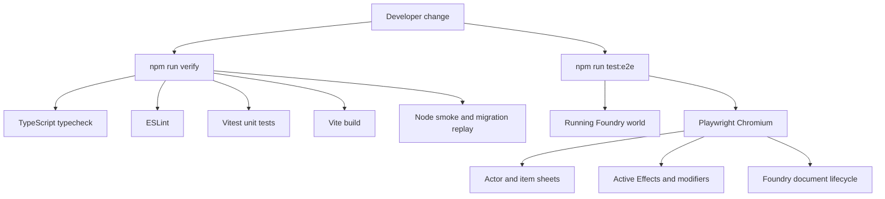
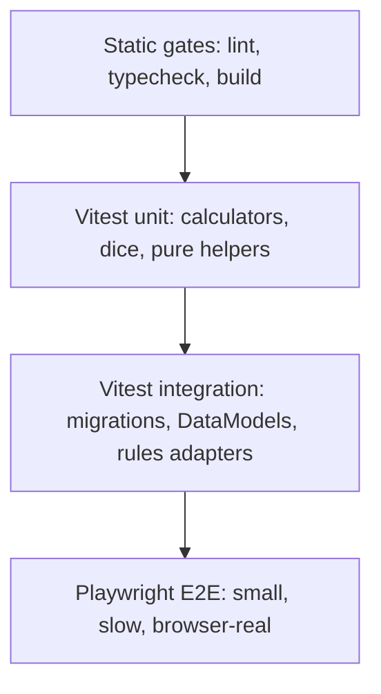

# Testing Strategy

This repo now uses a layered test strategy:

- Vitest covers fast unit and integration-style checks that can run without a
  live Foundry browser session.
- Playwright is the browser E2E runner for high-value Foundry UI and
  document lifecycle flows.

## Why Vitest Does Not Replace E2E

Vitest runs in Node with a DOM shim. It is the right place for calculators,
migrations, DataModel schema behavior, dice helpers, rules-system logic, and
pure Active Effect mapping.

Playwright runs against a real browser and a running Foundry world. It is the
right place for behavior that depends on Foundry runtime state, sheets, dialogs,
drag/drop, document creation, embedded documents, hooks, and browser rendering.

## Target Test Pyramid

## Commands

- `npm test`: fast Vitest suite.
- `npm run verify`: normal local quality gate; intentionally excludes browser
  E2E because it requires a running Foundry instance.
- `npm run test:e2e`: full Playwright suite.
- `npm run test:e2e:ae`: current Active Effects Playwright suite.
- `npm run test:e2e:ui`: interactive Playwright runner.
- `npm run verify:e2e`: normal verification followed by Playwright E2E.

## Playwright Runtime Configuration

Start a Foundry world with this system enabled, then run Playwright. Defaults
assume Foundry is available at `http://localhost:30001`.

If Playwright reports that Chromium is missing, run
`npx playwright install chromium`.

Supported environment variables:

- `FOUNDRY_BASE_URL`: Foundry server root URL.
- `FOUNDRY_TEST_USER`: Foundry user to join as; defaults to `Gamemaster`.
- `FOUNDRY_TEST_PASSWORD`: password for the selected user, if required.
- `PLAYWRIGHT_STORAGE_STATE`: path for the generated logged-in browser state.

